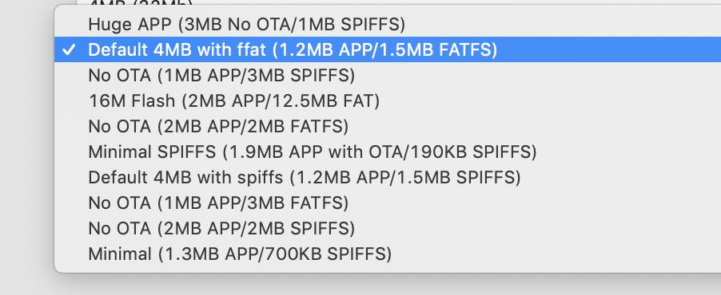

## Version 2.3
- **ESP32:**
  - das Speichern der Systemkonfigurationsdaten (CCU IP, Hostname, NTP etc) erfolgt ab sofort im NVS *und nicht mehr mithilfe einer Datei im SPIFFS*
    - ❗ **nach dem Einspielen dieser Version müssen die Konfigurationsdaten einmalig erneut eingegeben werden**
  - Umstellung des Dateisystems von SPIFFS auf FATFS
     - ❗wer den Quellcode selbst kompiliert: Compiler-Einstellung beachten! 
  - Begrenzung der lokalen Logdatei auf die letzten 1000 Einträge aufgrund von Stabilitätsproblemen   

## Version 2.2
- **ESP32:** 
  - Loggen in die CSV Datei erfolgt nur noch auf SD-Karte
    - bei Geräten ohne SD Kartenleser ist keine CSV-Datei mehr herunterladbar
  - fixed [#34](https://github.com/jp112sdl/AskSinAnalyzer/issues/34)
  - Einführung von WebSocket
    - an `/ws` können sich bis zu 3 WebSocket-Clients verbinden und Daten im JSON-Format (jeweils 1 Zeile pro Telegramm) empfangen, z.B.: 
    ```json
    {
      "lognumber": 305, 
      "tstamp": 1566241748, 
      "rssi": -88, 
      "from": "098765", 
      "to": "102938", 
      "len": 26, 
      "cnt": 210, 
      "typ": "WEATHER", 
      "flags": "BCAST RPTEN"
    }
    ```
- **WebUI:** 
  - Begrenzung der letzten 50 Telegramme beim initialen Laden der Webseite aufgehoben
    - die aktuelle Sitzung wird nun in einer lokalen Logdatei (im SPIFFS) des ESP32 gespeichert
    - die WebUI lädt alle Telegramme, die seit Start aufgezeichnet wurden aus der Datei und zeigt sie an
  - Import von CSV Dateien
    - eine heruntergeladene CSV Datei kann jederzeit importiert und dessen Inhalt angezeigt werden
    - wird eine CSV importiert, stoppt der Live-Abruf vom ESP32

## Version 2.0 / 2.1
- **ESP32**:
  - Veränderung der Abfrage der Geräteliste von der CCU
    - die bisherigen Systemvariablen `SV_Analyze_Input` und `SV_Analyze_Output` sowie das zugehörige Programm können gelöscht werden
    - ❗️ **es muss nun ein Skript ausgeführt werden ➡️ siehe [Wiki](https://github.com/jp112sdl/AskSinAnalyzer/wiki/CCU_Unterstützung)**
  
- **ESP32 / WebUI**: 
  - Unterstützung der *teilweisen* Dekodierung von HmIP_Funktelegrammen
    - Sender und Empfänger können angezeigt werden
    - *eine dedizierte Einordnung der Telegramm-Typen/-Flags ist nicht möglich*
